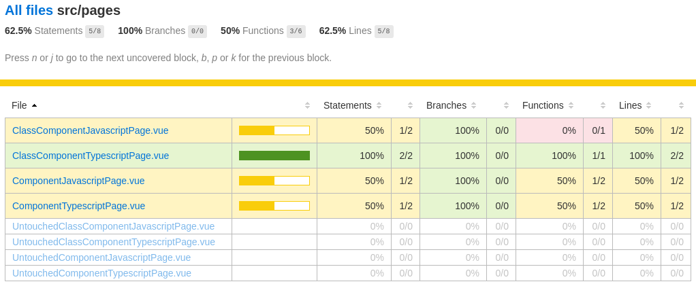
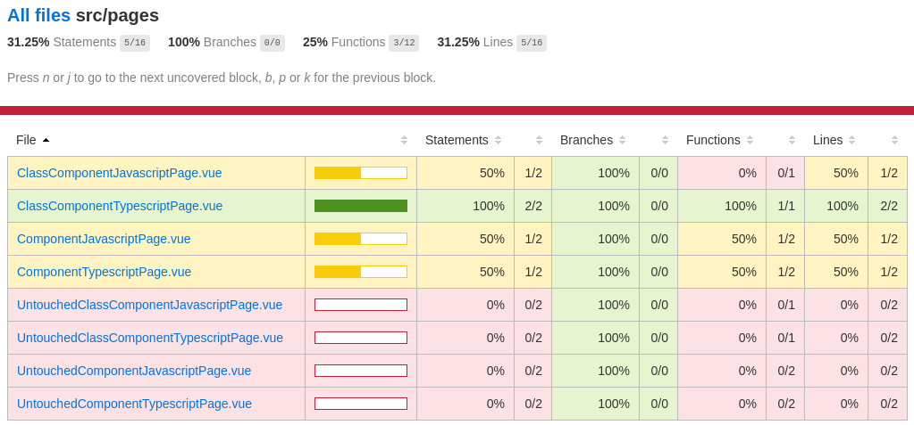

# Minimal Working Example for Code Coverage Generation

This repository should provide a minimal working example for code coverage generation with Vue, Typescript and Cypress by automatic code instrumentation.

## Problem

Unfortunately, the results were not as expected:
The test `tests.spec.js` only covered some components but did not touch the other components `Untouched*.vue`. 
When generating code coverage the report should show that the `Untouched*.vue` components are actually not covered and not just unconsidered. 

The report was misleading with an incorrect overall coverage:



Configuring nyc to consider "all" files did not work (at least in this setting) as described in the [official documentation for code coverage with Cypress](https://github.com/cypress-io/code-coverage#include-code).
The problem is probably caused by [Github: cypress-io/code-coverage #207](https://github.com/cypress-io/code-coverage/issues/207) and its related PR [Github: cypress-io/code-coverage #208](https://github.com/cypress-io/code-coverage/pull/208).

## Solution

The solution is to leverage the option `additionalEntries` of the `@cypress/webpack-preprocessor` and load all source files. See `tests/cypress/plugins/index.ts` for the implementation.

The report works as expected with a correct overall coverage:



## Installation

```
npm install
```

## Steps to reproduce

```
# Terminal 1
npm run start

# Terminal 2
npm run coverage:test:component
```

Code coverage report can be found in `tests/coverage/lcov-report/index.html`.
